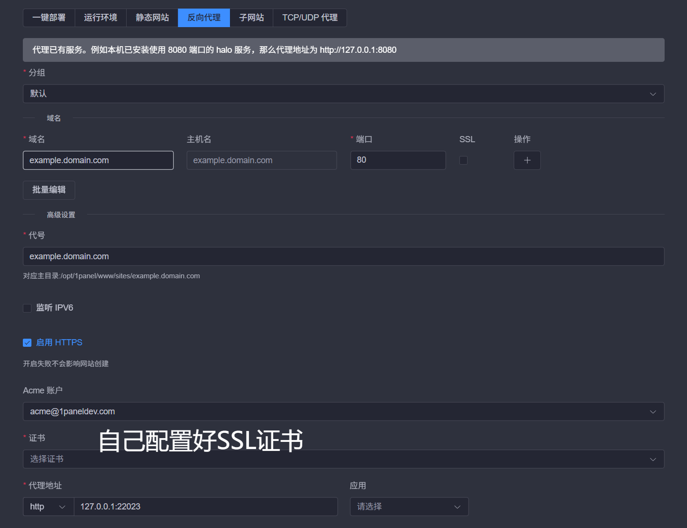

# 如何在 Linux 服务器上部署 Impostor 服务器

本文将带你从零开始，在 Ubuntu Server 上完成一个 Impostor 服务器的完整部署。

## 一、准备工作

在正式开始之前，确保你的服务器满足基本要求。

### 硬件与系统要求

Impostor 服务器资源消耗较低，以下是参考配置：

| 项目 | 要求 |
| :--- | :--- |
| **操作系统** | 推荐 **Ubuntu 20.04 LTS** 或更高版本 |
| **CPU** | 大于等于1核 |
| **内存** | 至少 **1 GB** |
| **存储** | **10 GB** 以上磁盘空间 |
| **网络** | 需要开放 **UDP 22023** 端口（游戏默认端口） |
| **公网** | 需要拥有 **公网IPV4地址** （AmongUs不支持IPV6） |

### 软件依赖

Impostor 使用 C# 编写，因此需要安装 **.NET 运行时**。本文以 .NET 8.0 为例（Impostor 对 .NET 5.0 及以上版本兼容）。

## 二、环境配置

### 1. 更新系统并安装必要工具

通过 SSH 连接到服务器后，首先更新系统软件包并安装基础工具：

```bash
sudo apt update && sudo apt upgrade -y
sudo apt install -y screen vim curl wget
```

### 2. 安装 .NET 运行时

访问微软 .NET 官方安装文档，选择适合你系统的安装方式。以 Ubuntu 为例，可以使用包管理器安装：

```bash
# 添加 Microsoft 包签名密钥和源
wget https://packages.microsoft.com/config/ubuntu/22.04/packages-microsoft-prod.deb -O packages-microsoft-prod.deb
sudo dpkg -i packages-microsoft-prod.deb
rm packages-microsoft-prod.deb

# 安装 .NET 运行时
sudo apt update
sudo apt install -y aspnetcore-runtime-8.0
```

验证是否安装成功：

```bash
dotnet --version
```

## 三、下载与配置 Impostor 服务端

### 1. 创建服务器目录

创建一个专用目录来存放服务端文件：

```bash
mkdir -p ~/Impostor
cd ~/Impostor
```

### 2. 下载服务端文件

Impostor 的官方发布页面在 GitHub 上。你可以使用 `wget` 下载最新 Linux 版本（具体版本号请以 GitHub Releases 实际发布为准）：

```bash
# 示例：下载 v1.10.6 版本（请替换为实际最新版本）
wget https://github.com/Impostor/Impostor/releases/download/v1.10.6/Impostor-Server_1.10.6_linux-x64.tar.gz
```

解压下载的文件：(解压后放入创建的Impostor文件夹，可直接使用bt/1panel面板)

```bash
unzip Impostor-*.zip -d impostor-server
cd impostor-server
```

> **提示**：如果 `unzip` 命令未安装，请先执行 `sudo apt install unzip -y`。

### 3. 修改配置文件

Impostor 的核心配置文件是 `config.json`。在启动前，你需要根据自己的网络环境修改它。

```bash
vim config.json
```

需要重点关注和修改的参数：

| 参数 | 说明 | 推荐值 |
| :--- | :--- | :--- |
| `Server` → `PublicIp` | 服务器的公网 IP 地址 | 你的服务器公网 IP |
| `Server` → `Port` | 游戏服务端口 | `22023`（默认） |
| `Server` → `ListenIp` | 服务监听地址 | `0.0.0.0`（监听所有网络接口） |

> **注意**：`PublicIp` 必须正确填写，否则外部玩家无法连接到你的服务器。如果需要更详细的配置选项，可以参考官方提供的 `config-full.json` 文件。

### 4. 开放防火墙端口

Impostor 服务器默认使用 **UDP/TCP 22023** 端口。如果服务器开启了防火墙（如 UFW），需要放行该端口：

```bash
sudo ufw allow 22023/tcp
sudo ufw allow 22023/udp
```

**重要**：如果你使用的是云服务商（如阿里云、腾讯云等），还需要在云控制台的**安全组**中，添加入站规则，允许 UDP/TCP 协议的 22023 端口。

## 四、启动服务器

### 方式一：直接运行（测试用）

在 `impostor-server` 目录下，执行以下命令启动服务器：

```bash
./Impostor.Server
```

如果提示权限不足，请先赋予执行权限：

```bash
chmod +x Impostor.Server
```

### 方式二：使用 Screen（推荐）

直接运行的方式会在关闭 SSH 连接后终止。为了让服务器持续在后台运行，推荐使用 `screen`。

1.  创建一个名为 `Impostor` 的 screen 会话：
    ```bash
    screen -S Impostor
    ```

2.  在 screen 会话中，进入服务端目录并启动：
    ```bash
    cd ~/Impostor
    ./Impostor.Server
    ```

3.  按下 `Ctrl + A`，再按 `D` 键，即可脱离（detach）当前 screen 会话，让服务器在后台继续运行。

4.  如需重新连接到该会话查看运行状态：
    ```bash
    screen -r Impostor
    ```

## 五、客户端连接

服务器启动成功后，在**理论上**你的朋友们就可以连接进来了。连接方法如下（**这只限于可以使用http网络协议连接的版本使用**AmongUs v1605以下）：

1.  访问 Impostor 的官方配置生成页面：https://impostor.github.io/Impostor/ 
2.  在页面中填入你的**服务器公网 IP** 和**端口号**（默认为 22023）。
3.  点击 “Download Server File” 下载配置文件。
4.  将下载的文件放入 Among Us 游戏客户端的AmongUs目录中，替换regioninfo.json文件。
5.  启动游戏，，即可看到并加入你的服务器。

## 六、 反向代理配置

### 1. 使用1panel面板配置反向代理
由于AmongUs在v16.0.5强制连接需要**Https协议**，所以我们需要配置**反向代理**。我们以1panel面板为示例



- 在域名的服务商将域名解析至服务器
- 创建以上的反向代理，实际端口根据前面所设定的更改（默认为**22023**）。
- 确保反向代理成功后可使用浏览器访问服务器地址例如**example.domain.com:22023**
- 如成功看见**Impostor Powered**等字样说明服务器已开启 可按照**五、客户端连接**的步骤执行

## 七、常见问题排查

### 1. 客户端无法连接到服务器

- **检查 `PublicIp` 配置**：确保 `config.json` 中的 `PublicIp` 填写的是正确的公网 IP。
- **检查防火墙和安全组**：确认 Linux 系统防火墙（如 UFW）和云服务商安全组均已放行 **UDP 22023** 端口。
- **检查服务器是否运行**：使用 `screen -r Impostor` 重新连接到会话，查看服务端是否有报错信息。

### 2. 服务器启动失败

- **检查 .NET 运行时**：运行 `dotnet --version` 确认 .NET 运行时已正确安装。
- **检查文件权限**：确保 `Impostor.Server` 文件具有执行权限（`chmod +x Impostor.Server`）。
- **检查端口占用**：确保 22023 端口未被其他程序占用。

### 3. 进入服务器被踢出

- 检查**config.json**中的**Anticheat反作弊**是否开启根据实际情况开启和关闭


### 4. 如何更新服务器版本？

1.  从 GitHub Releases 页面下载最新版本的**Impostor.Server/Impostor.Server.exe**。
2.  若**Impostor.dll**有更新也要一并替换
5.  重新启动 Impostor 服务器。

## 八、结语

至此，你已经成功在 Linux 服务器上部署了一个属于你自己的 Among Us 私服，拉上朋友圈一起愉快的玩耍吧！

**MinCiallo**
**2026.6.23**
